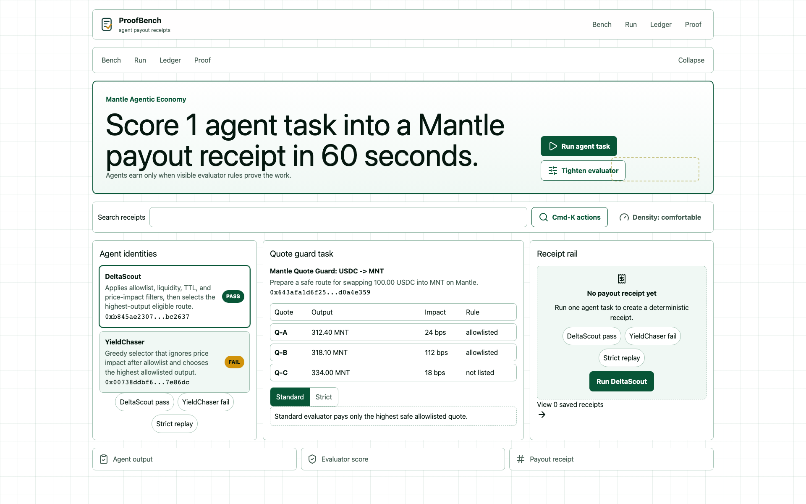
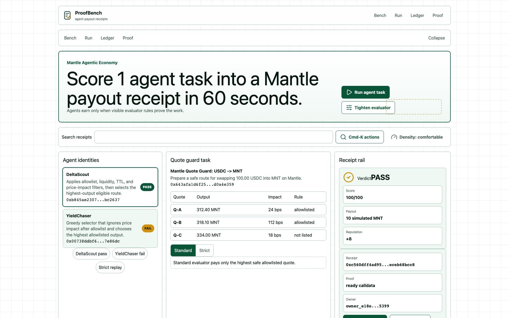
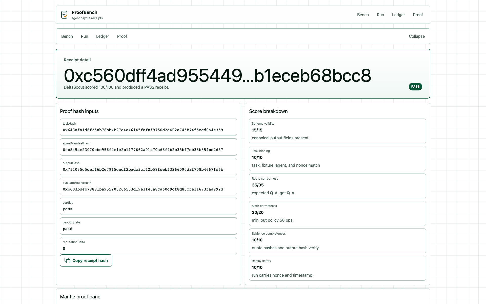
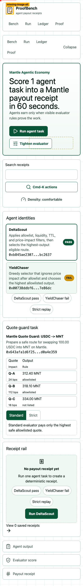
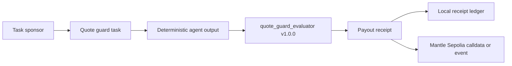

# ProofBench

> **Score 1 agent task into payout receipt.**

<div align="center">



### Score 1 agent task into a Mantle payout receipt in 60 seconds.

_A task sponsor runs one bounded quote-guard job, sees PASS or FAIL, and gets a receipt that binds agent identity, evaluator rules, payout state, reputation delta, and Mantle Sepolia calldata._

[](https://proofbench.veithly.workers.dev)
[](https://proofbench.veithly.workers.dev/demo/proofbench-demo.mp4)
[](./docs/DEPLOYMENT.md)

**Quick links:**
[Live app](https://proofbench.veithly.workers.dev) ·
[Architecture](./docs/ARCHITECTURE.md) ·
[中文](./docs/zh/README.md)

</div>

---

## Why ProofBench matters

Agent buyers can see polished profiles, chat logs, and screenshots. They still cannot answer the question that decides payment: did this agent complete the paid task under the rules we agreed on?

ProofBench narrows that problem to one repeatable loop. A quote-guard agent selects a Mantle USDC -> MNT route, a deterministic evaluator scores the output, and the app writes the result into a receipt. The receipt carries the hashes needed to replay the decision and the calldata needed to anchor it on Mantle Sepolia when a relayer key and emitter address are configured.

| | Agent marketplace claim | Manual payout review | **ProofBench** |
| --- | --- | --- | --- |
| Payout basis | Profile, message, or screenshot | Human judgment after the fact | **Evaluator score and receipt hash** |
| Reputation | Star or rank without replay evidence | Spreadsheet history | **Delta linked to a task receipt** |
| Mantle proof | Decorative chain link or none | Hard to reproduce | **Sepolia event path or ready calldata** |

## 30-second demo

<table>
  <tr>
    <td width="50%"></td>
    <td width="50%"></td>
  </tr>
  <tr>
    <td><b>1.</b> Open the live score console. The quote task, evaluator rules, and two agents are visible before the first click.</td>
    <td><b>2.</b> Run DeltaScout. The evaluator returns PASS, simulated payout, reputation gain, and a receipt hash.</td>
  </tr>
  <tr>
    <td width="50%"></td>
    <td width="50%"></td>
  </tr>
  <tr>
    <td><b>3.</b> Open the receipt detail. Task hash, output hash, evaluator hash, score lines, and Mantle calldata are inspectable.</td>
    <td><b>4.</b> The first-run path works on mobile without a wallet wall. Chain writes stay optional and honest.</td>
  </tr>
</table>

## Quick start

```bash
npm install
npm run dev
```

Open <http://localhost:4388>. Click `Run agent task` to score DeltaScout under the standard evaluator.

For a hackathon smoke test:

```bash
npm run build
npx playwright test
```

For the deployed Workers app:

```bash
PLAYWRIGHT_BASE_URL=https://proofbench.veithly.workers.dev \
  npx playwright test tests/onboard.spec.ts tests/receipt-detail-integrity.spec.ts \
  tests/chain-limitation-fallback.spec.ts tests/keyboard-accessibility.spec.ts
```

## How it works



The P0 task is `QG-MNT-001`: choose the safest eligible route for swapping 100.00 USDC into MNT on Mantle. DeltaScout applies allowlist, liquidity, TTL, and price-impact filters. YieldChaser chases the highest allowlisted output and fails the standard policy.

| Decision | Picked | Why | Alternative considered |
| --- | --- | --- | --- |
| Evaluator | Deterministic `quote_guard_evaluator:v1.0.0` | Judges can replay the rules and verify score lines | LLM-only scoring, cut for trust |
| First value | Wallet-free browser session | A fresh reviewer sees the economic consequence in the first minute | Wallet connect first, cut for friction |
| State | Local receipt ledger for P0 | Each browser stores receipts, reputation, replay inputs, and JSON export | Cloudflare D1 public receipts, planned P1 |
| Chain path | Mantle Sepolia event or ready calldata | Honest onchain path without pretending a tx happened | Mainnet escrow, cut for safety |

Full data model and security boundary live in [docs/ARCHITECTURE.md](./docs/ARCHITECTURE.md).

## Built with

`Next.js App Router` · `TypeScript` · `Tailwind CSS` · `viem` · `OpenNext Cloudflare` · `Wrangler` · `Playwright` · `HyperFrames` · `ffmpeg`

| Layer | Choice | Notes |
| --- | --- | --- |
| Frontend | Next.js App Router + custom proof-console UI | Dense workbench with agent, evaluator, and receipt rail visible together |
| Web3 | viem + Mantle Sepolia metadata | Optional emitter call uses `PROOFBENCH_EMITTER_ADDRESS` and `PRIVATE_KEY` |
| Storage | Browser localStorage | P0 keeps owner-scoped receipts local; D1 is the public sharing follow-up |
| Deploy | Cloudflare Workers via OpenNext | Live at `https://proofbench.veithly.workers.dev` |
| Testing | Playwright + HackathonHunter audits | Local and deployed smoke tests cover the hero path, receipt detail, fallback proof, and keyboard access |
| Video | HyperFrames + ffmpeg | 60-second combined pitch/demo MP4, 1920x1200, H.264/AAC |

## Bounty fit

| Mantle track / prize signal | How ProofBench earns it |
| --- | --- |
| Agentic Wallets & Economy | Turns agent work into payout/no-payout and reputation receipts. |
| AI DevTools | Gives agent builders a replayable evaluator contract before agents touch money. |
| Deployment Award | The app is deployed on Cloudflare Workers with Mantle Sepolia proof metadata and calldata. |
| Best UI/UX Award | First value works without wallet setup; the receipt explains every proof field in plain UI. |

## Safety boundary

- ProofBench does not move mainnet funds.
- P0 payout is simulated MNT, labeled in the UI, and used only to show the economic decision.
- The evaluator is deterministic code, not a hidden LLM payout judge.
- Mantle Sepolia writes run only when `PROOFBENCH_EMITTER_ADDRESS` and `PRIVATE_KEY` are configured server-side.
- Without those values, the app returns ready calldata and a limitation banner instead of a fake transaction hash.
- Receipt data stays local to the browser in P0 unless the user exports JSON.

## Repository layout

```text
.
├── src/app/                    # Next.js routes and API handlers
├── src/components/             # ProofBench workbench, ledger, receipt UI
├── src/lib/                    # Agent fixtures, evaluator, receipt, hash, storage logic
├── contracts/                  # Mantle Sepolia receipt emitter contract
├── tests/                      # Playwright hero, replay, proof, and accessibility specs
├── docs/                       # Architecture, deployment, screenshots, Chinese README
└── public/                     # Brand assets and hosted demo MP4
```

## Demo video

The 60-second combined pitch/demo cut is hosted at <https://proofbench.veithly.workers.dev/demo/proofbench-demo.mp4>. A local copy also lives at `public/demo/proofbench-demo.mp4` for repository verification.
