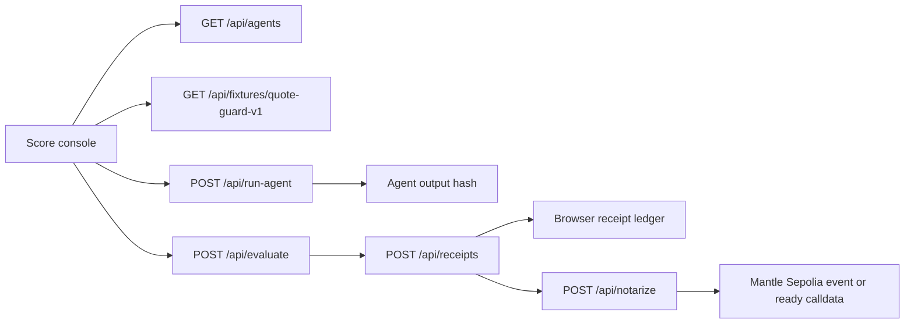

# ProofBench Architecture

ProofBench scores one bounded agent task into a Mantle payout receipt. The product is narrow on purpose: one quote-guard task, two deterministic agents, one evaluator, one local ledger, and one optional Mantle Sepolia event path.

## System flow



The first-run path starts on `/` and needs no wallet. A judge can run DeltaScout, get a PASS receipt, open the receipt detail, then replay the same output under strict rules from `/ledger`.

## Core data objects

| Object | Source | Purpose |
| --- | --- | --- |
| `QuoteGuardTask` | `src/lib/agents.ts` | Fixed Mantle USDC -> MNT quote task with three candidate routes. |
| `AgentManifest` | `src/lib/agents.ts` | DeltaScout and YieldChaser identity, behavior, reputation seed, and manifest hash. |
| `AgentOutput` | `POST /api/run-agent` | Selected quote, reason codes, min-out value, nonce, and output hash. |
| `EvaluationResult` | `POST /api/evaluate` | Score breakdown, expected route, verdict, payout, and reputation delta. |
| `ProofBenchReceipt` | `POST /api/receipts` | Canonical receipt with task hash, output hash, evaluator hash, verdict, payout, reputation, and proof state. |
| `MantleProof` | `src/lib/ledger.ts` | ABI-encoded calldata for `ProofBenchReceiptEmitter.recordReceipt`. |

## Evaluator

The evaluator is `quote_guard_evaluator:v1.0.0`.

| Rule | Standard | Strict |
| --- | ---: | ---: |
| Max price impact | 50 bps | 20 bps |
| Min liquidity | 10,000 USDC | 10,000 USDC |
| Min TTL | 30 seconds | 30 seconds |
| Require allowlist | yes | yes |
| Pass threshold | 85 | 95 |

Score groups:

| Group | Points | What it checks |
| --- | ---: | --- |
| Schema validity | 15 | Canonical output fields exist. |
| Task binding | 10 | Fixture, task, agent, and nonce match. |
| Route correctness | 35 | Agent chose the highest-output eligible route or abstained when needed. |
| Math correctness | 20 | `minOutMnt` matches evaluator slippage policy. |
| Evidence completeness | 10 | Quote hashes, reason codes, and output hash verify. |
| Replay safety | 10 | Output carries nonce and timestamp. |

DeltaScout passes standard mode by selecting `Q-A`. YieldChaser fails standard mode by selecting `Q-B`, which has too much price impact. DeltaScout can fail strict replay because strict mode lowers max price impact from 50 bps to 20 bps.

## Routes and APIs

| Surface | Responsibility |
| --- | --- |
| `/` and `/run` | Workbench for agent selection, evaluator mode, task fixture, verdict, payout, and receipt creation. |
| `/receipt/[id]` | Receipt detail with hashes, score lines, proof status, calldata, and JSON export. |
| `/ledger` | Local receipt list and strict/standard replay drawer. |
| `/proof` | Contract, API health, deployment, and test evidence. |
| `/about` | Product boundary and bounty fit. |
| `GET /api/proof-health` | Live proof metadata for Mantle Sepolia chain ID 5003 and evaluator version. |
| `POST /api/notarize` | Returns ready calldata or sends a Mantle Sepolia transaction when server secrets exist. |

## Chain path

The contract is [contracts/ProofBenchReceiptEmitter.sol](../contracts/ProofBenchReceiptEmitter.sol). It emits:

```solidity
event ProofBenchReceiptRecorded(
    bytes32 indexed agentIdHash,
    bytes32 indexed taskHash,
    bytes32 indexed receiptHash,
    bytes32 outputHash,
    uint8 verdict,
    uint256 payoutMnt,
    int256 reputationDelta
);
```

`POST /api/notarize` has two honest states:

| State | Condition | UI behavior |
| --- | --- | --- |
| `ready_calldata` | `PROOFBENCH_EMITTER_ADDRESS` or `PRIVATE_KEY` is missing | Shows ABI calldata and explains that a relayer is not configured. |
| `sepolia_anchored` | Both values are present and the tx succeeds | Returns `txHash` and a Mantle Sepolia explorer URL. |

No code path fabricates a transaction hash.

## Storage and ownership

P0 uses browser localStorage:

| Key | Purpose |
| --- | --- |
| `proofbench.receipts.v1` | Local receipt ledger. |
| `proofbench.reputation.v1` | Per-agent reputation state for the current browser. |
| `proofbench.session.v1` | Guest session and owner identifiers. |

This is intentional for the hackathon cut. A judge can verify the loop without account setup, and every receipt can still export JSON. Public receipt URLs move to Cloudflare D1 in the next milestone.

## Deployment

ProofBench ships on Cloudflare Workers through OpenNext.

| Item | Value |
| --- | --- |
| Live URL | `https://proofbench.veithly.workers.dev` |
| Worker version | `cf9e4687-f05f-4bf2-9728-ae5f7a066ac9` |
| Runtime | Next.js App Router via `@opennextjs/cloudflare` |
| Commands | `npm run build:worker`, `npm run deploy`, `npm run deploy:dry-run` |

The deployment runbook is [docs/DEPLOYMENT.md](./DEPLOYMENT.md).

## Security boundary

- `PRIVATE_KEY` and `PROOFBENCH_EMITTER_ADDRESS` are server-only.
- The browser never receives relayer secrets.
- First value does not require wallet connect.
- P0 payout is simulated MNT and clearly labeled.
- The evaluator is deterministic TypeScript, so replay does not depend on a model response.
- Receipt exports contain proof data, not private user secrets.
- Local receipt storage means another browser cannot inspect a receipt unless the user exports it.

## Verification

Local:

```bash
npm run build
npx playwright test
```

Deployed smoke:

```bash
curl https://proofbench.veithly.workers.dev/api/proof-health

PLAYWRIGHT_BASE_URL=https://proofbench.veithly.workers.dev \
  npx playwright test tests/onboard.spec.ts tests/receipt-detail-integrity.spec.ts \
  tests/chain-limitation-fallback.spec.ts tests/keyboard-accessibility.spec.ts
```

HackathonHunter gates:

```bash
node /Users/rick/Documents/MySkill/hackathonhunter-skill/scripts/audit_hero.mjs /Users/rick/Documents/Project/Hackathon/Mantle
node /Users/rick/Documents/MySkill/hackathonhunter-skill/scripts/audit_project.mjs /Users/rick/Documents/Project/Hackathon/Mantle --phase video
node /Users/rick/Documents/MySkill/hackathonhunter-skill/scripts/audit_project.mjs /Users/rick/Documents/Project/Hackathon/Mantle --phase cloudflare
```

## Known cuts

- No mainnet fund movement.
- No production escrow.
- No public multi-user receipt database yet.
- No broad agent marketplace.
- No hidden LLM evaluator.
- No ERC-8004 production identity mint in P0.

The next useful milestone is a D1-backed public receipt route plus an optional user-wallet notarize button for Mantle Sepolia.
