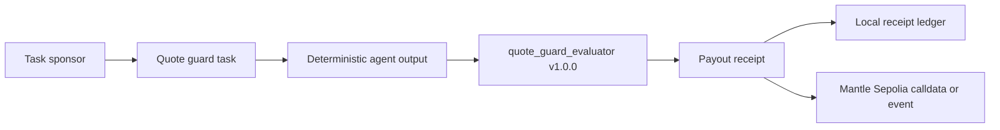

# ProofBench

> **Score 1 agent task into payout receipt.**

ProofBench 可以在 60 秒内把 1 个代理任务评分成 Mantle payout receipt。评审打开页面后，不需要先连钱包：选择代理，运行 quote-guard 任务，看到 PASS 或 FAIL，再打开收据检查 task hash、output hash、evaluator rules hash、payout 状态、reputation delta 和 Mantle Sepolia calldata。

[Live app](https://proofbench.veithly.workers.dev) · [Architecture](../ARCHITECTURE.md) · [Deployment](../DEPLOYMENT.md) · [Root README](../../README.md)

## 为什么做这个

很多 agent marketplace 展示的是简介、聊天记录、截图或排名。真正决定付款的问题没有被回答：这个 agent 是否按约定规则完成了付费任务？

ProofBench 把范围压到一个可复现的闭环。DeltaScout 和 YieldChaser 执行同一个 Mantle USDC -> MNT quote-guard 任务。`quote_guard_evaluator:v1.0.0` 决定 PASS/FAIL、模拟 payout、reputation delta，并生成可 replay 的 receipt。

| 对比项 | 常见 agent 声明 | 人工付款复核 | ProofBench |
| --- | --- | --- | --- |
| 付款依据 | 个人页、聊天、截图 | 事后人工判断 | evaluator score + receipt hash |
| 声誉变化 | 星级或排行榜 | 表格历史 | 每个 delta 绑定任务收据 |
| Mantle 证明 | 装饰性链上链接或没有 | 难复现 | Sepolia event path 或 ready calldata |

## 30 秒演示

1. 打开 `https://proofbench.veithly.workers.dev`。
2. 点击 `Run agent task`，默认 DeltaScout 会在 standard evaluator 下拿到 PASS。
3. 打开 receipt detail，检查 hash inputs、score breakdown 和 calldata。
4. 到 `/ledger` 把同一份 output 用 strict evaluator replay，观察结果变化，但原 receipt 不会被改写。

## 技术机制



核心文件：

| 文件 | 用途 |
| --- | --- |
| `src/lib/agents.ts` | 任务 fixture、两个 deterministic agents、evaluator 规则。 |
| `src/lib/receipts.ts` | 生成 canonical receipt 和 receipt hash。 |
| `src/lib/ledger.ts` | 生成 Mantle Sepolia contract calldata。 |
| `src/app/api/notarize/route.ts` | 如果有 relayer key 和 emitter address，就发送 Sepolia tx；否则返回 ready calldata。 |
| `contracts/ProofBenchReceiptEmitter.sol` | Sepolia receipt event 合约。 |

## 真实限制

- P0 不移动主网资金。
- payout 是模拟 MNT，UI 会标注。
- 没有 `PROOFBENCH_EMITTER_ADDRESS` 和 `PRIVATE_KEY` 时，系统只显示 ready calldata，不伪造 tx hash。
- 收据目前保存在浏览器 localStorage；公共 receipt URL 是下一步 D1 版本。
- evaluator 是确定性 TypeScript 逻辑，不用隐藏的 LLM 判断付款。

## 本地运行

```bash
npm install
npm run dev
```

打开 <http://localhost:4388>。

测试：

```bash
npm run build
npx playwright test
```

部署说明见 [docs/DEPLOYMENT.md](../DEPLOYMENT.md)。
